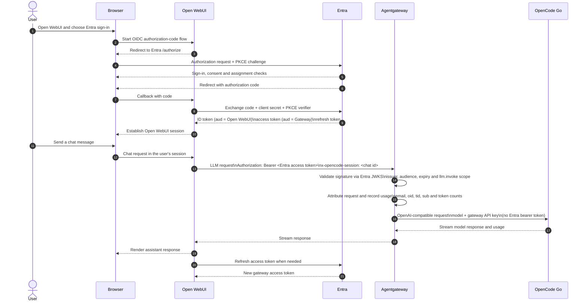

# Authentication and request attribution

This deployment uses two single-tenant Microsoft Entra application
registrations. Open WebUI is the OAuth client. Agentgateway is the protected
API that receives LLM requests. They are deliberately separate applications:
the access token issued for the gateway has the gateway as its audience, while
the ID token used to sign the user into Open WebUI has Open WebUI as its
audience.

## The registrations

### Open WebUI client

The **Open WebUI** registration is a confidential web client. It has:

- localhost and production redirect URIs ending in
  `/oauth/oidc/callback`;
- a client secret, used by Open WebUI's server-side authorization-code flow;
- `openid profile email offline_access` scopes; and
- the delegated `api://<gateway-application-id>/llm.invoke` scope.

Open WebUI uses authorization code flow with S256 PKCE. Its ID token contains
the `email` and `name` claims needed to create the Open WebUI account. The
first successfully signed-in account becomes the Open WebUI administrator;
subsequent assigned accounts receive the normal user role.

### LLM Gateway API

The **LLM Gateway** registration is a protected API. It has:

- an application ID URI of `api://<gateway-application-id>`;
- the enabled delegated scope `llm.invoke`; and
- v2 access-token issuance enabled.

It has no redirect URI and no client secret. The Open WebUI service principal
receives admin consent for the delegated scope. The Open WebUI enterprise
application is assignment-required, so only assigned users can sign in.

## End-to-end flow



The browser does not call Agentgateway directly. Open WebUI makes the
server-side request and forwards the user's Entra access token to the gateway.
The `x-opencode-session` value is stable for a conversation and is different
for a different conversation, which lets the upstream request stream retain
conversation-level attribution.

## Does Agentgateway validate the JWT?

Yes. The gateway is a token-validation boundary, not a transparent proxy. The
`jwtAuth` policy in `compose.yaml` is strict and validates:

1. the JWT signature using Entra's tenant JWKS endpoint;
2. the issuer, which must be the current tenant's v2 issuer;
3. the audience, which must be the LLM Gateway application ID; and
4. the token lifetime and other standard JWT time checks.

The authorization policy then requires the delegated `llm.invoke` scope. A
missing or malformed bearer token, wrong issuer or audience, expired token, or
missing scope is rejected before the model is called. The gateway removes the
validated Entra bearer token before sending the request to OpenCode Go. The
upstream call uses the configured OpenCode Go API key instead.

The gateway also removes browser cookies from the upstream request and sets an
identifying user agent (`open-webui-llm-oauth/1.0`). This keeps browser session
credentials and Entra tokens at the gateway boundary.

## How requests are attributed to Entra users

The validated access token supplies the signed claims used for the request
log:

| Claim | Meaning in the log |
| --- | --- |
| `tid` | Entra tenant ID |
| `oid` | The user's stable object ID in that tenant |
| `email` | The Entra email claim, when present |
| `sub` | The token subject; this is an opaque identifier and is not an email address |

The configured Agentgateway user label is selected as:

```text
email -> oid -> sub
```

The access-log fields retain the tenant ID, object ID and email separately.
The email claim is signed as part of the validated token; it is useful for
human-readable attribution, while `oid` is the better stable directory key.
The guest UPN is never substituted silently when the email claim is absent.

This is why the Agentgateway UI can show an address such as
`johan.carlin@gmail.com` for a new request, while older requests made before
the access-token email claim was configured can still show an object ID or
opaque subject. The request-log database is persistent, so those older labels
are not rewritten.

## Is this token passthrough?

Only in the narrow sense that Open WebUI forwards the access token to
Agentgateway. It is not passthrough through the whole system:

- Open WebUI obtains tokens for two different audiences and keeps its own
  session.
- Agentgateway validates the gateway access token and enforces its scope.
- Agentgateway records the authenticated identity and usage.
- Agentgateway strips the Entra bearer token before calling OpenCode Go.

Therefore this does **not** use one app registration for both components. A
single registration would make the audience and client roles ambiguous and
would remove the clean boundary between the UI client and the protected API.

## Current client restriction and its limit

The current gateway authorization rule checks the tenant-issued token's
`llm.invoke` scope after the JWT checks. Entra's delegated permission grant is
configured for Open WebUI, so the normal token path is restricted to that
client. However, the gateway rule does not currently add a separate exact
`azp`/`appid` check for the Open WebUI client ID.

That means another client that could legitimately obtain a token for this API
with the same delegated scope would also satisfy the gateway policy. If the
deployment later has more OAuth clients or needs a strict client allowlist,
add an authorization condition for the v2 `azp` claim equal to
`WEBUI_CLIENT_ID` (and verify the claim in a real access token before enabling
the rule). Do not try to enforce this with a caller-supplied header.

## Local checks

The local stack exposes:

- Open WebUI: `http://localhost:3000`;
- Agentgateway API: `http://localhost:4000/v1`; and
- Agentgateway request-log UI: `http://localhost:4001/ui/llm/logs`.

After signing in and sending a chat, the request-log detail should show the
model, input/output usage, and the Entra attribution fields. The following
checks exercise the gateway boundary without exposing any credentials:

```bash
curl -i http://localhost:4000/v1/models
curl -i http://localhost:4000/v1/models \
  -H 'Authorization: Bearer not-a-valid-token'
```

Both requests should be rejected. A valid gateway access token with
`llm.invoke` should succeed, while a valid token for another audience or a
valid token without that scope should be rejected. Token renewal is exercised
by keeping the Open WebUI session open until the access token expires and then
sending another message.
